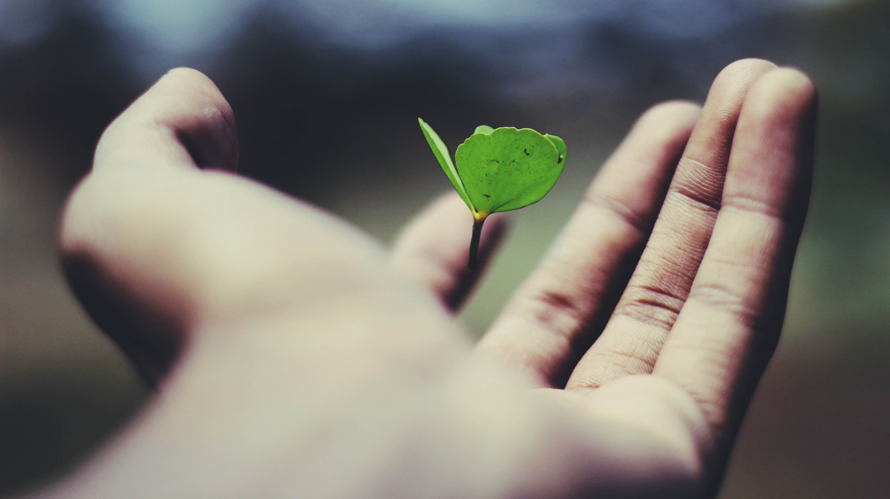
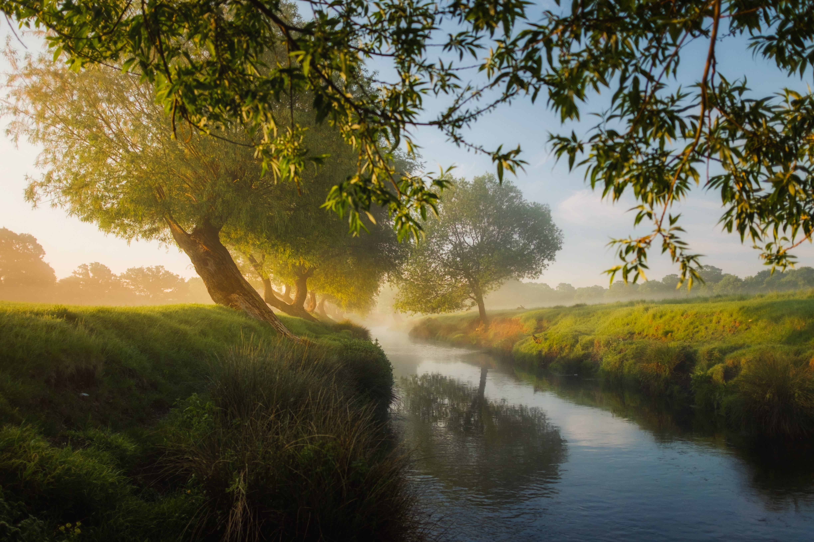

# 我想要的状态

**2022年，1月11日，星期二，广州天河，多云**

我现在觉得我几年前的目光过于短浅，那时目标简单，没有长远计划，得过且过。这两年我的进步接近零，我想要改变这种状态。

我以前觉得程序员很酷，可以开发自己想要的各种程序。当我成为程序员之后，就也没有这种感觉了。甚至有时候感觉自己就像是行尸走肉，没有灵魂和思想。工作两年多来，慢慢地丢失了那么追求炫酷的热情。

不过既然选择了这条路，就要走下去，把它变得有意义。那什么才变得有意义呢？我觉得在这个行业里，不断地完成自己的各项目标，提升自己，达到一个新的起点，就是一件有意义的事！

我现在也慢慢思考，在工作中的每个需求。怎样才能把需求做得更好，同时提高自己，而不仅是把需求做完。

我期待这样一种状态，有充足的时间，能深度思考问题，每次思考都有进步，我也想拥有足够的知识和自信。但要达到这些目标，需要做很多努力，加油！