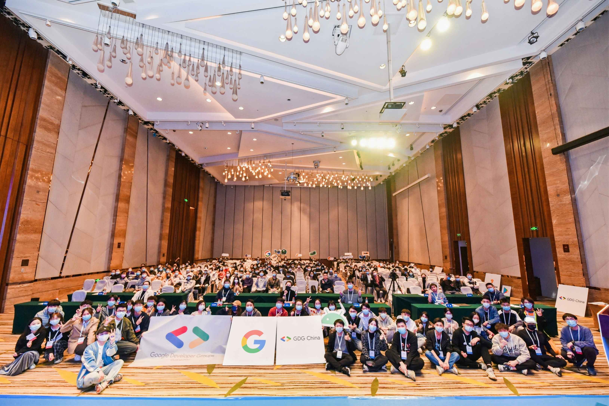

# 参加开发者社区活动有什么意义？

**2022年1月16号，星期天，广州天河，多云**

今天我去参加了 Google Developer Groups 谷歌开发者社区 活动，即广州GDG 活动，但由于现在的相关情况不稳，到场的人不多。

我觉得参与开发者活动是一件很有意义的事情，并收获到的在于以下三点：

- 1. 认识优秀的人，吸纳优秀开发者的经验
- 2. 增长见识，了解新的技术
- 3. 不断地给思考自己所处的水平

参加开发者活动的目的不仅仅是为了周末放松，在了解新技术的同时还可以了解到同行人所做的事情。更重要的是思考自己所处的位置，从中不断地优化自己的目标，确定自己将来的方向。

分享一下今天的几张照片

主席台：

我的纪念照：

大合影：

