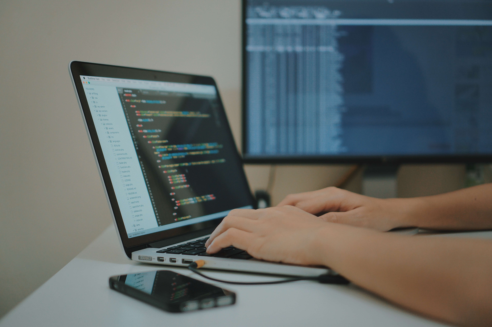

# 程序员是怎样的一群人

## 程序员是怎么样的一群人？

如果用一句通俗易懂的语言来描述，以“写代码为工作内容的人群就是程序员”。

我本身是个写服务器端程序的程序员，今天分享一下自己做两年程序员的心得，从程序员本身去认识程序员。

程序员的有诸多类别。在程序员中，写服务器端程序的程序员被称为后端工程师；写web程序的程序员被称为前端工程师；还有写Android手机原生APP被称为Android工程师；写iPhone手机原生APP叫IOS工程师。当然了，还有其他工程师，比如负责软件质量测试的被称为测试工程师，负责整个系统的运行和维护的被称为运维工程师，还有AI工程师、大数据工程师、算法工程师等等。

实际上，“工程师”是别人对程序员的有礼貌或者说尊敬的称呼，实际上大家都知道“程序员”就是工厂工人而已，俗称码农！

我们一般说的程序员，很多时候指的是前端工程师和后端工程师，也就是现在大部分互联网产品的开发人员。一个软件产品从开发到上线，后端工程师和前端工程师都充当着核心的技术人员。

## 程序员的工作是什么？

我们主动在手机上安装的APP，比如QQ、微信、抖音等等，都是我们所说的互联网（软件）产品。

通常，每个互联网产品在诞生之初，每一个功能细节，交互细节，都是软件产品经理设计出来的一个概念。而程序员日常的工作就是根据产品经理设计的产品原型，用代码去实现产品的功能。简单的说就一句话，“根据需求用代码实现功能”。

一批功能的开发往往需要几天，多则几个月，都是程序员用代码一行一行的编写出来。

前端工程师的工作主要是完成程序界面的开发、用户界面的美化、交互逻辑与交互动画的优化，等等。在一个系统钟中，用户看到的界面部分都是由前端工程师开发实现的，前端的开发语言主要是JavaScript和TypeScript。

后端实现的主要是存数据和读数据，用户数据的计算和数据存储 都在服务器完成，这就需要后端工程师编写服务器端程序来实现，运行在服务器端的热门开发语言包括：Java、PHP、Python、Golang等。

前端工程师追求的目标是把界面写的好看、布局合理、用户交互体验良好；而后端追求的目标是将数据进行计算与存储，不出差错，且程序要注重高效快速。

当一个产品开发完成之后，需要不断地优化与升级，包括客户端程序和服务器端程序。一个程序员的技术好不好，体现在对编程语言的熟练程序，对开发工具的熟练运用程度，以及应付工作的能力。

传统的互联网程序开发，是有门槛的，需要程序员去学习一门编程语言的基本语法，并且能运用其解决问题。但是也没有什么难度，当你投入学习之后，掌握的知识越来越多，解决的问题的能力也随之提高。

## 程序员的焦虑

实际上，传统的程序开发。每天可能在做重复的工作，无非就是用代码来实现软件功能。

说的明白一点就是：前端工程师无非每天写界面，后端工程师无非每天对数据进行增删改查。每天做着重复的工作，就像工厂里的工人。区别是工厂流水线上的工人产出的是实物，每天下班就回家；而程序员产出的是一个看不见摸不着的“东西”，还不一定下班就能回家。

可能还有点区别是，程序员的做的东西学习成本更高一些。不过，如果一直是普通的程序员，年龄越大就越容易被淘汰！

所以，在你还是学生的时候，要争取一切的时间去学习，不断强大自己。不要自己写一些简单而又基本的代码，就忘乎所以。应当不断提供自己的内在素养，包括为人处事、思想觉悟。还应不断提供自己综合能力，包括专业功底、表达能力、英语阅读能力等等。当自己变得优秀，就不怕世界容不下自己！

如果已经离开了学校，在工作之余，不忘学习，不断提升自己！

## 除了工作，不要忘了生活

程序员的工作往往有压力，压力来源于工作，也来源于生活。相信部分小伙伴是程序员或者即将成为程序员，工作重要，固然也要好好生活，不忘给自己惊喜！

比如说：
昨天是10月24号，传说中的 “程序员节”，路过 “小米之家”，想来想去，作为一个喜欢电子产品的程序员，也很少给自己买奢侈的电子产品。于是花199买了个红米蓝牙耳机。

我想起两年前，有一天qq群里突然在讨论买耳机的事，有一位群友说，不上两千的耳机听着真的没有一点感觉，于是群里开始热闹起来，从讨论买耳机到这种电子产品。我说：“我用899的手机配上15块的耳机，你们用的耳机都比我手机贵”。

两年后过去了，我也终于用上了超百元的耳机😂。

