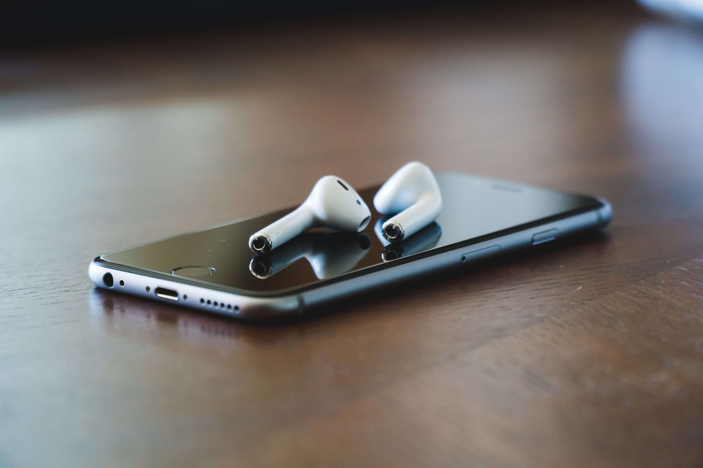

# 工作与心情日记

2021.10.26  星期二  多云

分享一下这两天的工作内容之一。

我所在的公司是互联网公司，公司运营着自己的互联网产品。过两天是公司的周年会，所以有一个周年会的开发需求：需要在周年会的当天，用户打开 我们的APP将弹出红包雨，然后用户可以进行抢红包，抢到的以金币的方式派发给用户。当然了，我们派发出去的金币实际上是可以进行提现的，也就是一种虚拟的奖励。

我负责服务器端的派发逻辑，与我对接的同时负责前端的交互开发工作，今天下班前我已经开发好了，不过前端那边工作量稍微大一些。到明天就可以做联调测试，后天上线了！

其实，程序员有个幸福感的来源，那就是当你知道自己写的程序给成千上万用户使用的时候，内心会有一种无比的满足感！就像今天写的这个程序功能一样，过两天后就会被用户使用。想想还是挺开心的！

最近，转变了自己的一些想法，我利用上班通勤时间，在地铁上多看一些优质文字内容，或者学习一些知识，充实自己，希望有个突破。

这几年不知道怎么，养成了多种坏习惯，慵懒、消沉，还经常熬夜，也不喜欢看书学习。平时只管吃喝，也不注重锻炼身体了。我也希望自己能写一些文字，养成个良好的习惯，记录自己的生活。

实际上，如果你静下心来阅读一些文学作品，会调节自己的心情、充实自己的思想。我记得我上次养成阅读的习惯是在高中，那时候经常有机会阅读《读者》、《青年文摘》，我很敬佩那些书刊上的能写出优美文字的作者们，他们富有思想、有内涵、有感染力，文笔能深深地吸引读者。他们往往激励着读者，让人更加坚定地追求自己的目标和理想，不迷失自我！

我最喜欢的一本书文学作品是《安妮日记》，在高中的那段日子里，这本书伴着自己度过一段很长的焦虑、急躁的一段时期。我们每个普通人的内心经历也就像安妮一样，都会经历各种  期望、好奇、开心、恐惧、焦虑，在迷茫中徒步前行。她分享我们的是，如何勇敢、坚强地对待未知的生活。