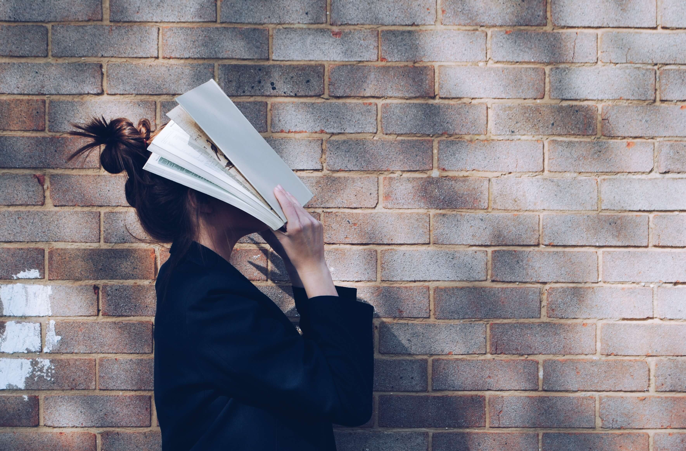

# 手机占据了我大部分可支配的时间

**2021.11.01**，**广州**，**多云**

> 我计划重新更新技术视频了。近期的视频现在已经在整理文档和规划中，会尽快完成录制。以后除了发 B 站，我还会发公众号。之后的技术视频，我的目标是要比以前的内容高质且高效。也希望能给订阅该公众号的技术小伙伴们，有价值的参考。

今天又是晚点开始写作，在开始前的两分钟，我还在刷短视频。

过去很长的一段时间里，每天的闲暇时间我总是习惯性地刷短视频。特别是在周末的时候，不知不觉一整天就过去了。这无疑浪费了自己很多学习的时间。

后来，我给手机上常用的两个视频娱乐 APP 设置了防沉迷，每个 APP 只要当天使用时间达到 1 小时就会立即提醒我。

但是，现在仔细想了想，自从我开启防沉迷后，这两个 APP 应该是每天都提醒我，而提醒我之后，我还把防沉迷关了。也就是说，我每天花在手机娱乐上的时间至少是两个小时。

这么说来，霎时觉得自己每天浪费的时间太多。过去的五六年里，自己每天把时间浪费在无意义的事情上太多太多了。恶习日积月累，以至于现在亏欠的太多。眨眼间，自己就年近三十了。

实际上，我之前是有多次类似的领悟，恰逢这次用文字用文字记录下来。希望在此以后，改掉浪费时间的坏习惯。

毕业两年，现在还是一事无成，我确实感觉到慌了。所以上周开始写日记，记录一些流逝的时间，希望能让自己心安些，或者说通过日记获得精神上的救赎。我还是想，不该让每天的日子白白的过去，无意义的流逝。也不希望现在的日子永远都是一望不到头！

