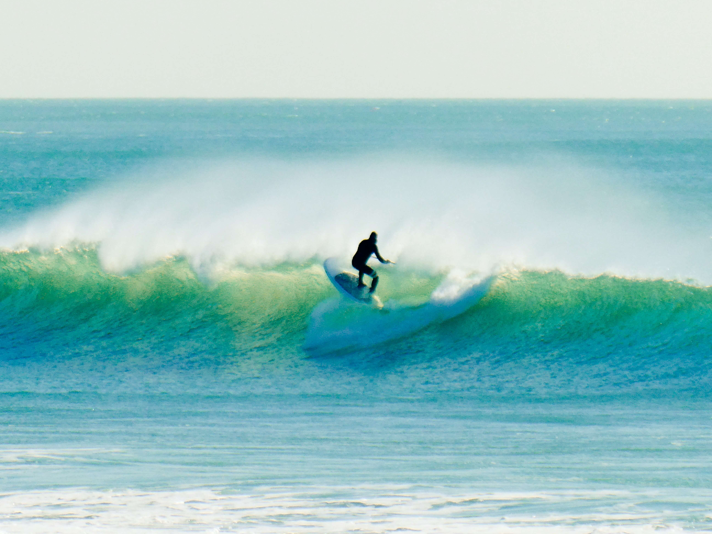

# 好好活着就是做很多有意义的事，做有意义的事就是好好活着
**2021.11.10  广州   晴**

> 这篇日记在下班回家的地铁上撰写，晚上23:30排版完成定时在0点发出。
>

这段时间每天更新一篇文章，半个月过去了，有一半时间以上占用了自己正常睡眠的时间。不过因为在个人心态上，平静且知足了许多。

以往每天下班的时候，身心俱疲，灯火霓虹的大城市里，总感到一丝孤寂，没有自己的归属之地。我不禁打开短视频，希望能从短视频中，脱离现实的苦海。但往往一刷就是两个小时，而愉悦感是短暂的，伴随而来的是更多是焦躁与不安。

自从开始写日记，思想上得到了一些安抚。自从开始写日记后，经常晚睡，累是累，但内心深处得到安慰，是满足的。

忙碌的时候让人感到充实，相反悠闲的时候让人感到焦躁。所以不应当畏惧将来，追求目标很困难，但会因为自己的努力而变得有意义！

我想起了《士兵突击》电视剧里的情景，就像许三多所说的，好好活着就是做很多有意义的事，做有意义的事就是好好活着！