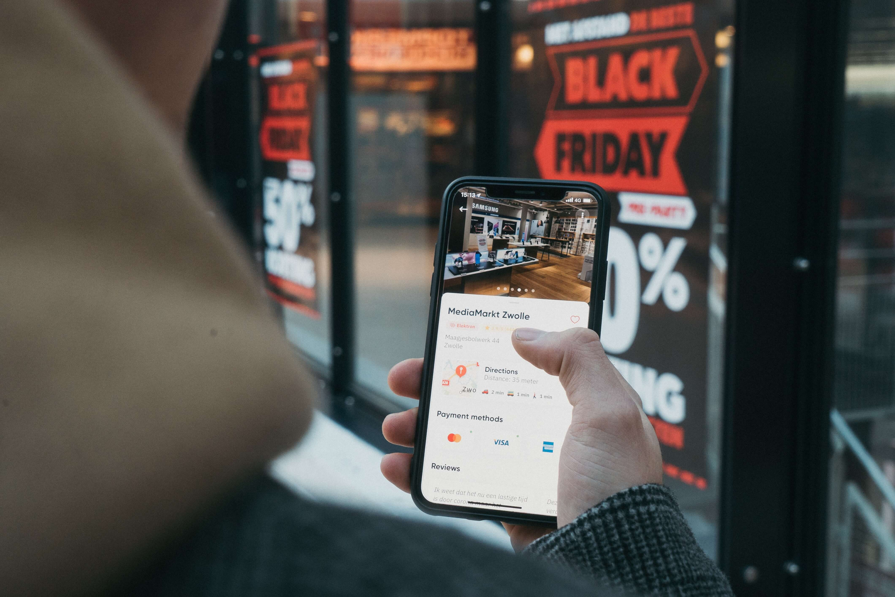

# 双11我买了一个手表

**2021.11.11 广州 晴**

今天是双十一，说一下双十一吧。

在这之前，原本不想买什么东西的。凌晨12点钟的时候，所在的公寓WIFI突然卡了，我意识到大家都在购物。看到大家买，打开商城看，我也买，花了几百块钱网上购物。自己挺喜欢电子产品的，不过舍不得买，今天给自己买了一个电子手表。

我第一次知道“双11”这个概念的时候，大概在10年前，那时候很多人还以“光棍节”的名义过11月11日这一天。高中班里，很多同学会以这个日子表示自己单身，自己光荣，不过，我并不喜欢参与相关讨论。后来，我知道这个日子变成了购物节。

后来，在移动互联网行业突然爆发的那几年，就有了双十一购物的说法。我自己从来不舍得购买一些贵重的物品，所以那时候也趁这双11的日子，买了零零碎碎的一些衣服和鞋子。

不过，近几年对双十一不感兴趣了，一是确实没什么东西可买的。而是随着生活的压力，逐渐地把注意力放在努力赚钱和思考明天上，早已不把双十一当作一种乐趣。

不过有件事值得提的是，如果真的有购物需求，在双11的时候，在价格上也确实优惠些。

