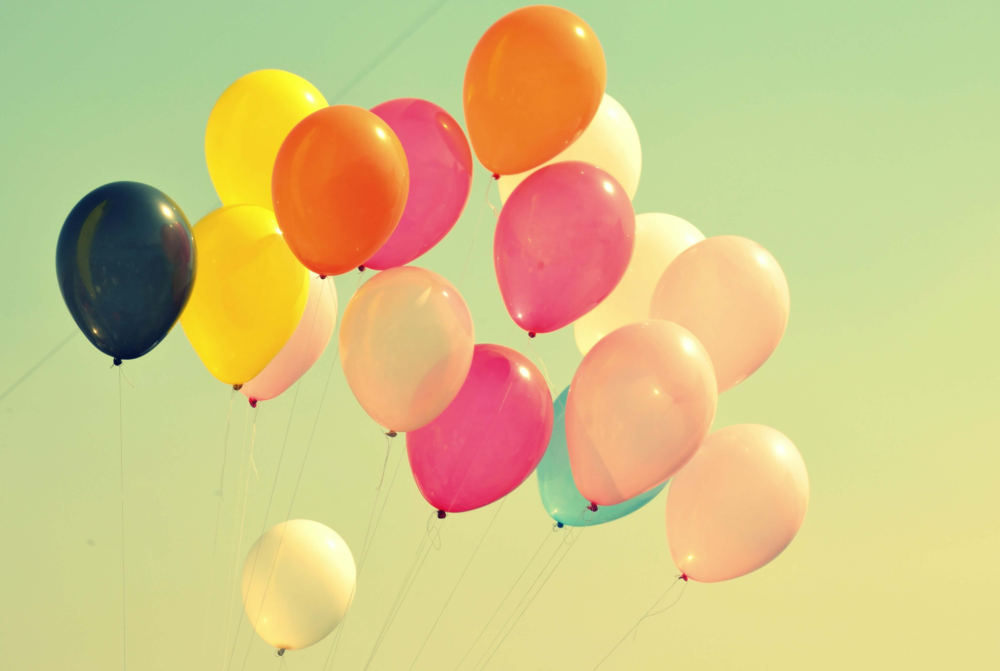

# 在我满25岁的时候，第一次吃上了生日蛋糕

**2021年11月16号，星期二，广州，多云**

如果不是公司举办员工的生日会，我应该忘记了自己的生日了。不过今天不是我实际的生日，但却是意义上的生日。

出身自贫困大山里的我，在小的时候，没有生日这个概念，那时候的目的仅仅是希望父母能筹足学费，够自己读书而已。

这二十多年，和身边的朋友过了很多次生日。后来，我也开始关注到自己的生日，自己生日到的时候，便会提醒自己一定要过的有意义，除了精神上鼓舞自己，另外也许会给自己买好吃的，仅此而已。自己却不曾吃过自己的生日蛋糕，也不曾举办过生日聚餐。

在很多年里，忙着忙着，在生日当天结束的时候，便突然想起来自己又长了一岁，却很少有惊喜。今天是11月16号，却是自己第一个意义上的过生日。这是自己所在公司给员工举办的生日宴会，有蛋糕，有零食，有水果，还有礼物。之所以令人觉得难忘，是因为在过去的任何一年里，是没有的！我也由此愿意分享自己激动的心情。

在激动与喜悦之余，也意识到25岁之路已经成为过去，在迈向26岁的途中。

我今年最大的改变，大概就是不再像以前那样逍遥自在。家中有父母，心里也想着事业，同时还有未组建的家庭。自己的能力却不足以解决自己的想解决的事物。如今变得冷静，变得沉着，也变得害怕时间流逝！

我希望在接下来一年中，不负自己！

