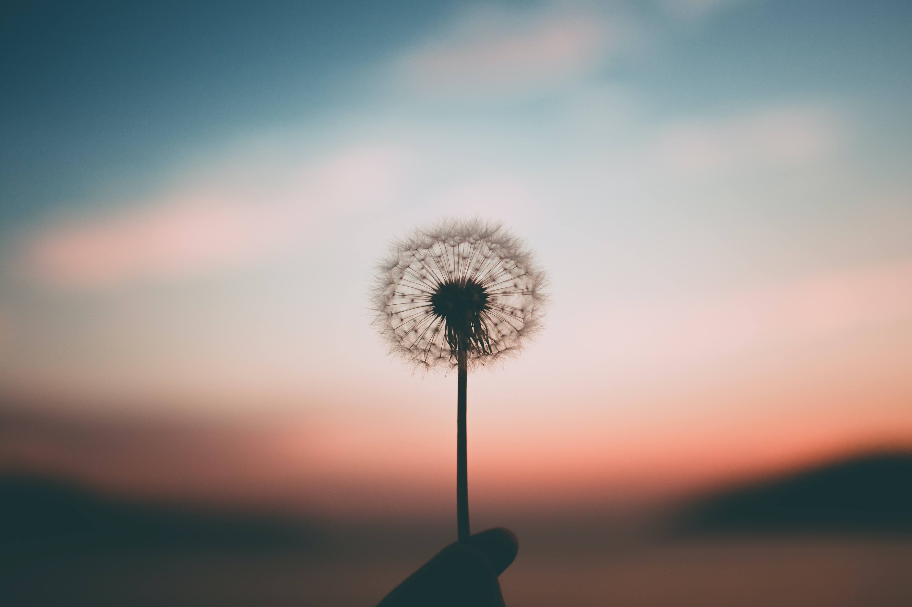
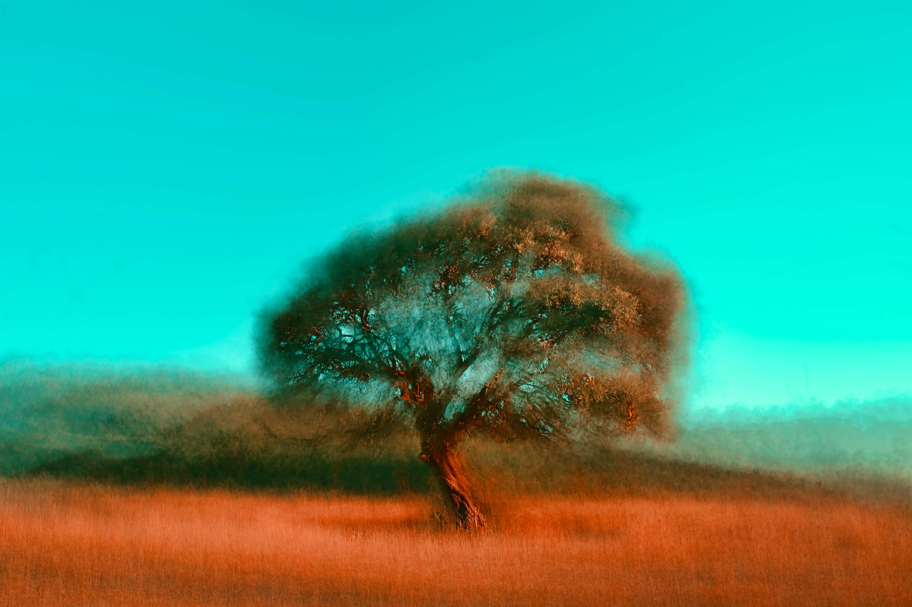

# 今年还剩下四十多天，我要给明年制定一下目标

**2021.11.18，星期四，广州，多云**

转眼间2021年就要结束了，今年，我更加害怕时间的流逝。只是因为我开始意识到，时间越往后走，我将会离人生的终点越靠近。而今年我在生活上也发生了一个大的变动，那就是离开了原本生活两年的城市，来到自己一直梦想着却没有勇气闯入的地方。

今年，最大的目标实现了，那就是改变了自己的生活环境，但很多小事自己觉得不尽人意。在四十天几天过后，今年也将会成为历史，我希望在接下来的这段日子里，给自己补充一些知识，让自己更好地迎接下一年。同时，我也将在今年接下来的这些日子中，制定好明年的目标与方向，然后勇往直前！

在近一年时间了，我经常懊悔为什么在三年前自己应该学会的技能，到到现在还没掌握，真正该用到时才觉得为时已晚。其实不止今年，在过去几年里时间里，自己没有坚定的目标、没有明确的计划，恍然间时间就划过了几年。即使自己制定了计划，也并没有坚定不移地去完成去执行。原本计划学习的技能、要做的事，可能因为某种原因就半途而废了。

近段时间我想着自己的过往，脑海里闪现着零零散散的时间碎片，却没有记录到有意义的事情。也正是因为过去的生活没有目标、没有计划，以至于让时间白白浪费掉。现在我想改变这样的现状！

今年大概还有四十天，我将在这四十天中里努力去完成自己曾经的学习任务。我也会在这四十天时间里给自己制定下一年的目标与计划，希望自己在明年将结束的时候，能有所收获。

希望明年这个时候的我，能完成自己即将制定的目标。也希望自己今后能把过去没有做好的事情做好，勇敢地执行自己既定的计划，不再退缩！要相信，如果不努力，永远达不到目标的终点。也要相信即使每天努力一点点，时间会给我们惊喜！