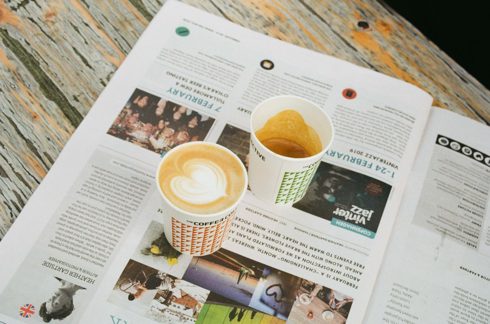

# 我到底在干什么？我到底想怎么样？

**2021年12月5日，星期天，晴**

不知道大家有没有过这样的一段经历，在学校的时候，想尽早离开学校，想及时步入社会。但到了社会上，才觉得学校的日子是多么令人向往！尤其在今天，我再次受到精神的打击！

感觉自己现在心理压力挺大的，如今自己已经是满二十五岁了。如果换在20年前，大多人早已成家立业。而如今的我，正处在这个敏感的时间段里，未成家未立业，无车无房无存款，感觉自己什么事情都没做好。

本来今天为了放松一下心情去爬山，不过途中我父亲给我打电话，原本愉悦的心情瞬间沉静下来。全程都是不愉快的交流，从最开始问我什么时候回家，到问我什么时候能结婚。在他的语言中，虽然不直接说，但我很明确他的意思。就是在责问我，你到底在干什么？你到底想怎么样？

我表达的是，我现在刚毕业两年，不要那么逼迫我。谁不想早日成家立业，但我现在一点存款都没有，能解决温饱就不错了，我还能做什么！

近一年来，我经常回忆过去的学生时代，我十分怀念那段时间，我感受到现在背负的心理压力太多了。以前我经常给自己规划各种未来，我计划着在既定的时间内必定做好一些事，那时也盼望着自己计划将来的时间早点到来。但在现在看来，似乎一切都没有那么称心如意。

有时候我也在想，我到底在干什么？我到底想怎么样？