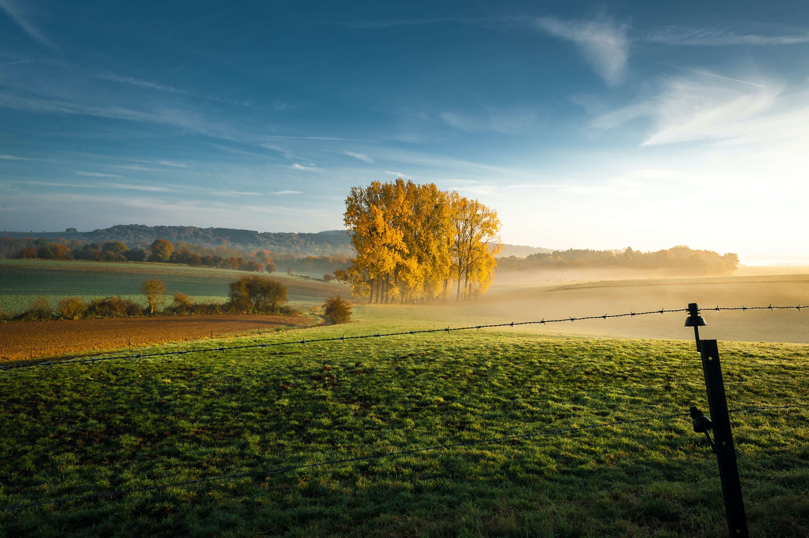
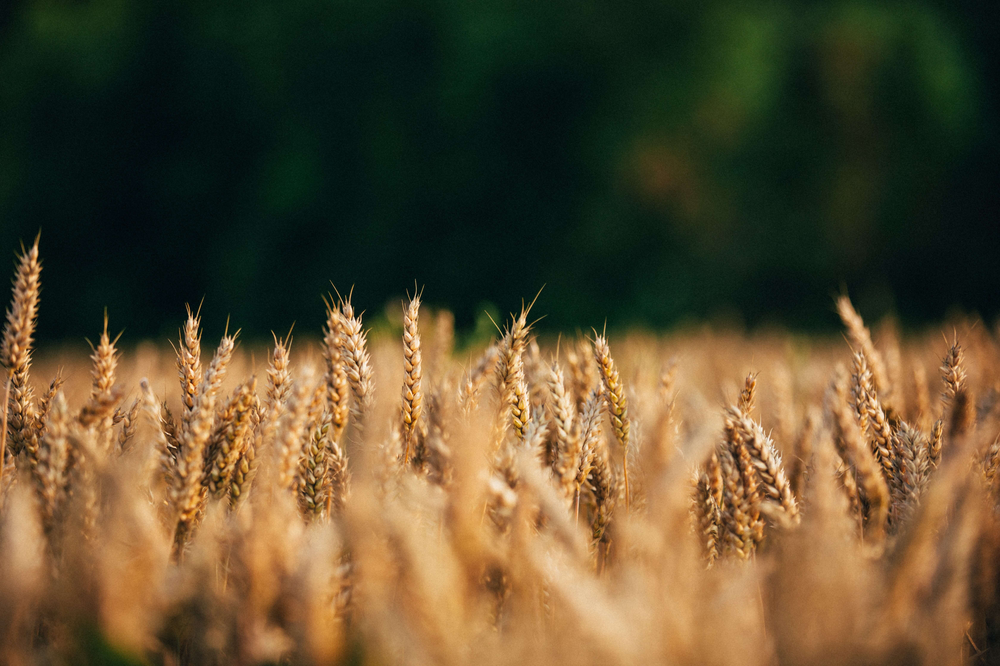
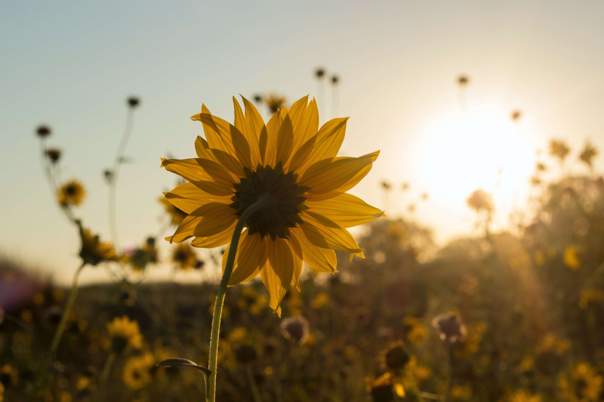

# 广漂打工的年底生活日记

**2021年12月19号，星期天，广州天河，多云，16度**

**感悟**

我记得，小时候曾经过着一段无忧无虑的日子。但是小时候总是期待自己能快一点长大，因为觉得长大了可以不受到各种束缚。一直到我读的大学那段时间，我都希望自己能够尽早离开学校。而近两年我才逐渐明白，其实作为学生才是最幸福的！

现在能深深体会这个道理，是因为我觉得年纪越大，需要承担的事情就越多，同时自己的能力又不足以在短时间内解决自己遇到的种种难题。

**近期工作与生活**

我的九九六工作已经过去一周了，在接下来的这一周我将继续九九六工作。上周休息的时间是挺少的，今天饱饱地睡了一觉，同时也放松了一整天。

上周每天早起晚归，基本上每天回到住处已经是晚上十点钟以后。回到住处洗漱之后，我继续打开电脑整理当天的笔记。因为决定每天要产出一篇笔记，这些天牺牲了自己挺多休息的时间，不过我会坚持下去，而现在要做的就是优化时间的安排。

我前些天报名了广州 “谷歌开发者大会” 的现场活动，不过今天知道活动当天我需要加班，所以与这次活动就无缘了。其实我一直想能现场参与这个顶尖软件公司的技术分享活动，只是以前是没有条件。没想到今年来了广州，这次还刚好错过机会，希望下次能赶上机会吧。

明天开始又继续工作了，在这一周我们部门将进行年终述职，明天我还需要把PPT准备好。

**调整方向，不断努力**

现在自己终于成为了一名普普通通的打工人，虽然与小时候的梦想相差甚远，但是要接受现实。其实每个普通人都不容易，原本我们想着按着自己的剧本走完这一辈子，但总是事与愿违，很多时候感觉挺累的。不管今年过得怎么样，人都该往前看，勇敢的迎接新的一年。

希望2022年，调整好自己的方向，不断努力，不断进步，积极向上！

