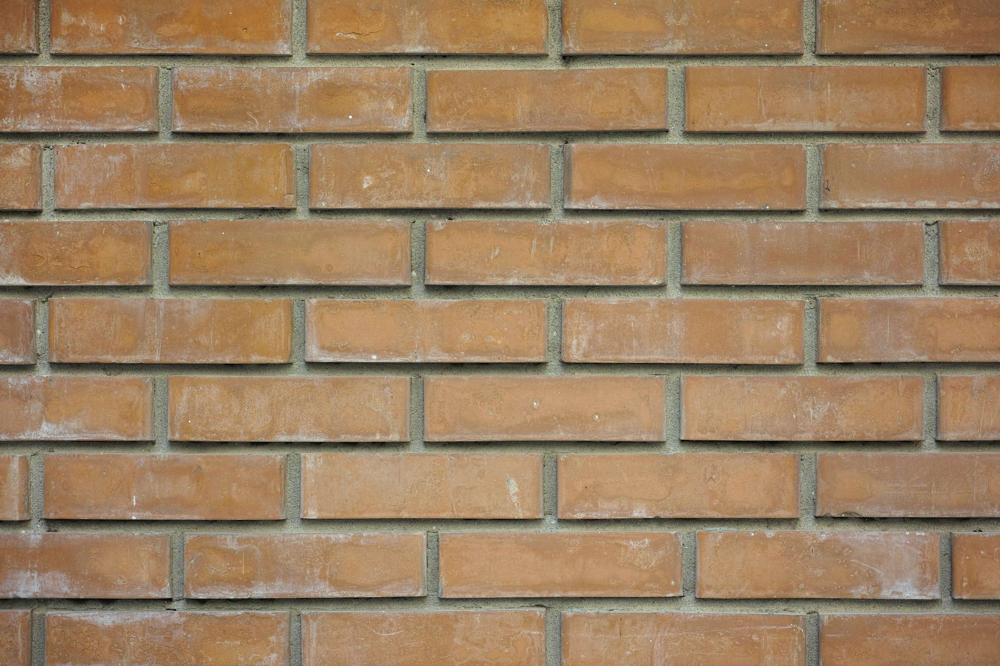

# 这段时间挺累的，你是否也曾经过身心疲惫？

**2021年12月29日，星期三，广州天河，多云**

年底了，还有很多事情没有做好，突然感觉到挺累的。想必有小伙伴也是，今天的日记不知道写什么，就表达一下自己的心情吧。

我最近每天都在坚持学习新知识、努力工作、写笔记、背单词、阅读文章，我希望能在有限的时间内，做更多的事情。虽然很累，但是我知道付出了时间肯定是否有收获的，即使微乎其微。

其实我相信很多人都和我一样，无非就是希望通过现在的努力积累，让自己在将来有能力把该做的事做好。为的是在今后的人生道路上遇到困难时，希望从现在的积累中有所启发，走得更顺利。也为的是今后有能力孝顺父母，为了家庭更美满，甚至想在社会上实现自己的价值。

现在我的生活中计划着很多事情，可是为什么要那么累？随意一些不好吗？

以前的不太在意，现在年近三十，只是有点不甘心那种一望不到头的日子。

我很想把自己想做的事情做好，所以一直在努力，也因此付出各种代价！也曾面临各种 痛苦、无助、误解、身心疲惫！

